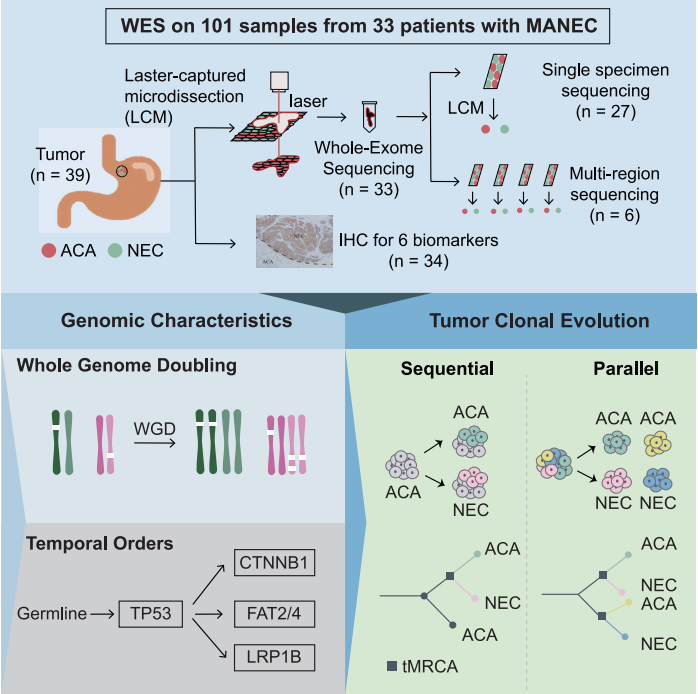

<!-- README.md is generated from README.Rmd. Please edit that file -->

```{r, include = FALSE}
knitr::opts_chunk$set(
  collapse = TRUE,
  comment = "#>",
  fig.path = "figures/README-",
  out.width = "100%"
)
```

# Mixed Adenoneuroendocrine Carcinoma (MANEC)

<!-- badges: start -->
<!-- badges: end -->

Gastric mixed adenoneuroendocrine carcinoma (MANEC) is a heterogeneous tumor composed of adenocarcinoma (ACA) and neuroendocrine carcinoma (NEC) components. This paper is designed to resolve the genomic landscapes and evolutionary clonal origins of this rare cancer. This repository contains the code used in our publication "Precise microdissection of gastric mixed adeno-neuroendocrine carcinoma reveals its genomic landscapes and evolutionary clonal origins". All R code used in the analysis is included.




The main analysis code is stored in **analysis**. Please see the folder `analysis` for details.

## Datasets

1. mutations

[mutdata_all](/data/mutdata_all.rda)


2. copy number variations

[manec.seg.sequenza](/data/manec.seg.sequenza.rda)

3. clinical information

[clinical.20210508](/data/clinical.20210508.txt)


## Citations

If you are using code or data in academic research, please cite our paper:

Qiu M Z, Chen Q, Zheng D Y, et al. **Precise microdissection of gastric mixed adeno-neuroendocrine carcinoma dissects its genomic landscape and evolutionary clonal origins**. Cell Reports, 2023, 42(6).  [link](https://www.cell.com/cell-reports/pdf/S2211-1247(23)00587-9.pdf)


